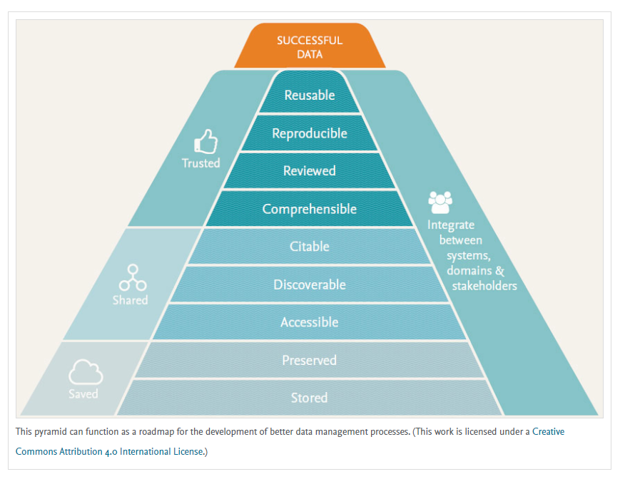
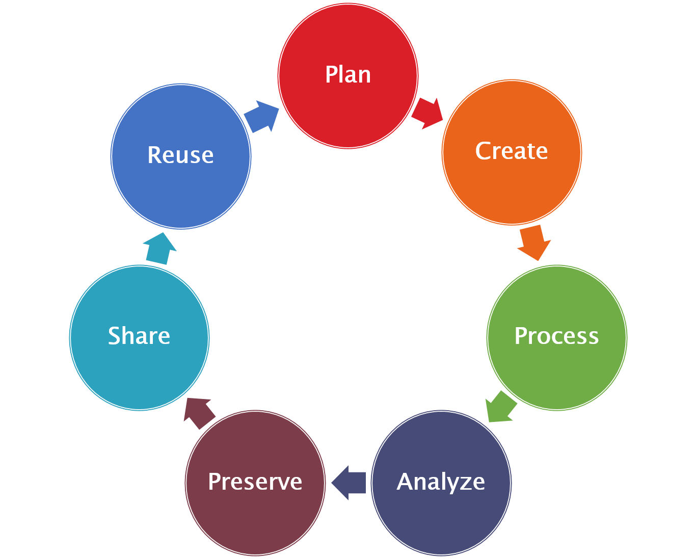

# GEOG 712 Reproducible Research

## Session 4.  Research Data Management Principles

### What is Research Data Management (RDM)?

Research Data Management is the active organization and maintenance of data throughout the research cycle which use standards and best practices to promote the security and integrity of data resulting in well-described, discoverable and reusable data.

From the McMaster ROADS website:
https://roads.mcmaster.ca/research-data-management-at-mcmaster
> RDM is the active organization and maintenance of data throughout its lifecycle, from its collection, interpretation, dissemination, and the archiving of valuable results. RDM enables reliable verification of research results, and permits innovative, interdisciplinary research built on existing information. The application of RDM improves cumulative research efficiency, and reduces the overall cost of research

### The Case for RDM?

[Data Sharing and Management Snafu in 3 Short Acts](https://www.youtube.com/watch?v=N2zK3sAtr-4)

### Who Benefits from Research Data Management?

- **You and your Collaborators**:  Setting up processes and standards for how you collect, document and organize your data will mean that you spend less time on data management over the course of your research.  You will spend less time searching for files and trying to "figure things out" when you have properly managed your data.  Collaborators (including your future self) will have an easier time understanding and using the data too!  Additionally, getting data to a point where it is accessible by others will increase impact and citations.

- **Journals**:  RDM is critical in providing the supporting data that journals are requiring more and more often.  Provision of data is critical to reproducability and credibility.  

- **Funders**:  Funding agencies, particularly public funding agencies are under pressure to increase their accountability and show value for their investment in research.  They also understand that data that is discoverable/reusable may prevent duplication of effort and accelerate new research. 

- **Science/Body of Knowledge**:  Well managed data will be discoverable, accessible and understandable making it ultimitely reusable for new science or study!  

### Drivers of RDM - Data as a Research Output

**[Tri-Agency Statement of Principles on Digital Data Management (TASPDDM)](http://www.science.gc.ca/eic/site/063.nsf/eng/h_83F7624E.html?OpenDocument)**: Promotes excellence in digital data management practices and data stewardship in agency-funded research

**Expectations:**

- Data Management Planning
- Constraints and obligation (commercial, legal, ethical)
- Adherence to Standards
- Collection and Storage
- Metadata
- Preservation, Retention and Sharing
- Timeliness
- Acknowledgement and Citation
- Efficient and Cost Effective

**Responsibilities:**

**Researchers**
- Incorporating best practices
- Developing DMPs
- Adhering to policies and standards

**Research Communities**
- Developing & promoting standards
- Fostering excellence
- Selecting repositories

**Research Institutions**
- Supporting best practices
- Providing access to resources
- Creating guidance and policies

**Research Funders**
- Developing policies & guidance
- Promoting data management
- Providing peer reviewers

### DRAFT:  [Tri-Agency Policy on Research Data Management](http://www.science.gc.ca/eic/site/063.nsf/eng/h_97610.html)
**Acceptance of funds indicated the acceptance of the the terms of the policy**

**Calls upon institutions a strategy to "provide its researchers with an environment that enables and supports world-class research data management practices including:**
 - Recognizing data as a research output
 - Supporting the implementation of data management practices in accordance with ethical/legal/commercial obligations
 - promotion of the importance os data management to researchers, staff and students
 - Providing guidance on managing data in accordance with principles outlined in TASPDDM
 - Development of institutional data management policies and standards for data management plans
 - Ensuring researchers have data management plans in place
 - Providing access/support for preservation/curation platforms
 
 **Calls on Researchers to:**
  - Complete Data Management Plans
  - Deposit data in recognized digital repository
  
  **This document is still in draft and will be implemented gradually to allow capacity to build
  

### FAIR (Findability, Accessibility, Interoperability, and Reusability) Data Principles

- The term FAIR was coined at a Lorentz workshop in 2014
- The paper "The FAIR Guiding Principles for scientific data management and stewardship" was published in Nature: Scientific Data in 2016
- Outlines a set of 14 principles to be addressed in making data FAIR:

TO BE FINDABLE:
F1. (meta)data are assigned a globally unique and eternally persistent identifier.
F2. data are described with rich metadata.
F3. (meta)data are registered or indexed in a searchable resource.
F4. metadata specify the data identifier.

TO BE ACCESSIBLE:
A1  (meta)data are retrievable by their identifier using a standardized communications protocol.
A1.1 the protocol is open, free, and universally implementable.
A1.2 the protocol allows for an authentication and authorization procedure, where necessary.
A2 metadata are accessible, even when the data are no longer available.

TO BE INTEROPERABLE:
I1. (meta)data use a formal, accessible, shared, and broadly applicable language for knowledge representation.
I2. (meta)data use vocabularies that follow FAIR principles.
I3. (meta)data include qualified references to other (meta)data.

TO BE RE-USABLE:
R1. meta(data) have a plurality of accurate and relevant attributes.
R1.1. (meta)data are released with a clear and accessible data usage license.
R1.2. (meta)data are associated with their provenance.
R1.3. (meta)data meet domain-relevant community standards.

### Hierarchy of Needs

### The Research Data Lifecycle

Stage | Description
-|-
PLAN  |Survey available/existing data; define data needs/collection plan; review ethics and legal constraints; review necessary resources (storage, instrumentation, time, money); data responsibility and stewardship   | 
CREATE| Produce data:  Derive, experiment, observe, measure, model, survey, obtain from third party sources. Capture metadata and documentation.
PROCESS | Digitize, qualtiy assurance, validation, recoded, versioned etc. Processes must be documented. Keep raw data raw.
ANALYZE | Conduct your analysis and interpretation to produce publications and research findings.  
PRESERVE | Ensure data is saved according best practices (i.e. open formats, well documented). Article publications and/or data publications should have a digital object identifier (DOI).  
SHARE | Determine appropriate access rights/licensing/citation and a proper long-term storage location for the data (e.g. Domain specific repository, on a controlled access server with open metadata and well defined access procedure).
REUSE | Data can be reanalysed, secondary analysis can take place, data can be used by others.

### Portage Network

The Portage Network was launched in 2015 by the Canadian Association of Research Libraries (CARL) and it works within the library community to foster a national research data culture and facilitate shared stewardship of research data in Canada.  This mandate spans sectors, domains, and jurisdictions, requiring national coordination of RDM services and infrastructure. Portage seeks to contribute to this goal through:

- The coordination of RDM expertise, services, and technology
- Collaboration with other research data management stakeholders
- Education and training

The DMPAssistant is one part of their service. The DMPAssistant is similar to tools offered through other jurisdictions (e.g. DMPTool (U.S.)).  The tool serves as a guide to help researchers develop a comprehensive snapshot of the data involved in their project.  

Data Management Plans are living documents and can evolve over time.

  
### Activity

1. Reflect on the data in your project 
    - Have others collected similar data?
    - Are there standards and best practices in your lab?  Field?
    - Are you doing primary data creation or using building upon/deriving something new from existing datasets?
    
    
  
### Suggested readings

[The FAIR Guiding Principles for scientific data management and stewardship](https://www.nature.com/articles/sdata201618)

[DataONE Primer on Data Management:   (https://www.dataone.org/sites/all/documents/DataONE_BP_Primer_020212.pdf)

