# GEOG 712 Reproducible Research

## Session 7. Creating packages in R and documenting datasets

In the preceding sessions we learned about Data Management Plans. There are several key aspects of these plans, including how to document not only data, but also how data were processed, and also how to transfer it, either to a supervisor, colleagues, students, or other interested parties.

In this session we will learn about packages in R. Although by no means the only way to document and share data (and processes), packages offer a convenient way of bundling up code, data, documentation, and examples in a conveniently shareable and usable unit.

Creating packages can become quite a sophisticated matter, depending on what their objective is. Here, we will work on a small example, and at the end you will find suggested readings that you can follow to deepen your understanding of the art and the technique of package creation.

### Packages

According to (Wickham)[http://r-pkgs.had.co.nz/], packages in R are "the fundamental units of reproducible code". 

Packaging code in this way has been no doubt one of the reasons why the R ecosystem became and has remained hugely popular; another reason being a relatively simple and effective way of finding, installing, and managing packages. Many R packages increase the functionality of R, but a package can serve other functions and distribution is not necessarily the only reason to create a package. Packaging code and data forces you to go through the process of organizing all your materials, documenting them, and possibly creating examples. This might come handy when, in the future, you need to revisit a project. It can help you to explain what you have done. And it can enhance reproducibility of research, if a package is a companion to a paper you write.

We will use an example as we cover the basic steps of creating a package. To see what the outcome of that might look like, follow this [link](https://github.com/paezha/Reproducible-Research-Workflow/tree/master/Session%207%20Creating%20R%20packages%20and%20documenting%20data) and download the file `packr_0.1.0.tar.gz`. Save the file in a place where you can find it easily, because the next step will be to install the package (make sure that you type the correct path, or as an alternative, make the folder where the package installer is the working directory):
```
install.packages("PATH/packr_0.1.0.tar.gz", repos = NULL, type = "source")
```

As an alternative, you can install from GitHub:
```

```

If you succeeded in installing the package, you can proceed to load it now:
```
library(packr)
```

Try the following:
```
?packr
```

### What goes in a package?

An R package consists of, at a minimum, one function or one dataset, and depending on how the package is created, one or more files that support the package.

Over time, a standardized folder structure has been refined to ensure that package creation and distribution is as seamless as possible. This is how a package folder might look like once that it has been developed:


Notice the following _essential_ components:

- A folder `R/`: this is where code goes
- A folder `man/`: this is where documentation goes

A package must include these two. In addition, it can include:

- A folder `data/`: this is where datasets in `.RData` format go. Raw data (for instance, Excel files, `.csv` files, `.shp` files, etc.) is stored elsewhere depending on whether it will be shared or not.
- A folder `vignettes/`: this is where more extended examples of use of the package go

There is in addition an `Rproj.user/` that is created when the R project associated with the package is created in R Studio. This folder may not exist if the package is created from the command line. Finally, there is a `raw/` folder; this is a custom folder that I created to put things that I used in the process of creating the package, but that are _not_ part of the package. More on this next.

Now, lets look at some of the files there:

- `NAMESPACE`: A text file with space for _names_ that map the value of objects to their names. Sounds confusing? It is because it is one of the most confusing aspects of creating a package, but fortunately not critical if you are developing packages for yourself or for limited circulation. If you wish to submit your package(s) to the central repository CRAN, then this becomes more important, because `NAMESPACE` helps to avoid conflicts between packages, among other things. See more about `NAMESPACE` [here](http://r-pkgs.had.co.nz/namespace.html). 
- `DESCRIPTION`: A text file that describes in a standard way the package
- `.RBuildignore`: this is a text file that tells R to ignore files or folders when building the package. For instance, the `.Rbuildignore` file in this particular package contains the following three lines:
```
^.*\.Rproj$
^\.Rproj\.user$
^raw$
```

Which means that the project files and folder as well as my custom `raw/` folder will be ignored when building the package.

There are some rules to write the names of things to exclude in the `.Rbuildignore` file. If I write only `raw`, it will exclude _everything_ that contains the characters "raw". For instance, if I had a script named `withdraw.R`, it would be excluded. So we need to define more clearly what it is that we wish to exclude. 

The character `^` is used to indicate the beginning of an expression and the character `$` indicates the end of an expression. By writting `^raw$` I ensure that only things that are named _exactly_ `raw` are excluded.

This should give you a broad panoramic of what goes into a package. Lets now review these elements in turn by means of an example.

### Initializing a package

As mentioned above, there are two ways to create a package: using the command line, or using R Studio. We will use the latter.

Package creation (and maintenance) in R Studio is linked to the use of _Projects_. Creating a project in R Studio creates a file and an invisible folder to store auto-saves and other items. The advantage of working in projects is that work can be compartmentalized: the project will _remember_ where its files are, what options are used, and so on.

We will begin by creating a project, which can be done by going to the drop-down menu at the top and clicking `File > New Project`:

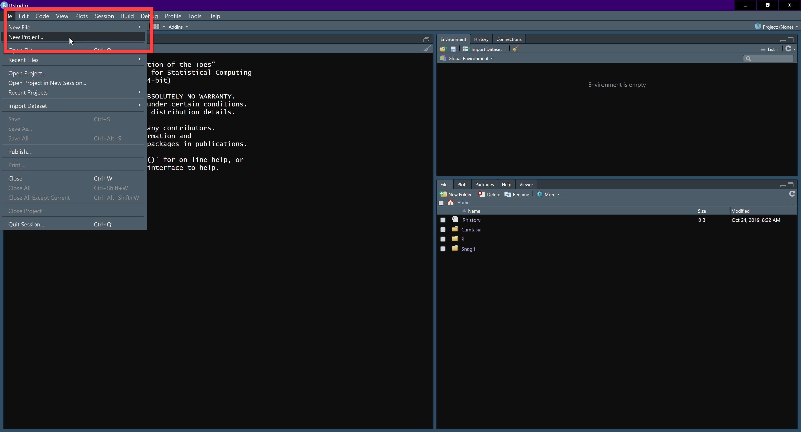

As an alternative, a new project can be created using the Create a Project button under the `Edit` drop-down menu:


Or using the Projects menu near the right-top corner of the window:


We create a new project to initialize a package. This is done by choosing a new directory:


Notice that you can create different types of projects (a plain vanilla project, or an R package, or R packages with various additions, such as Rcpp, devtools, etc.) Each of these alternatives will initialize different packages and options for you. We will choose `Create a new R package`:


Choose the directory in your system where you want to create your project and package. This could be under a directory that already has version control, or version control can be added by clicking the tick box `Create a git repository`. You also need to give your package a name. Package names must include only letters, numbers, and periods (no other special symbols), and the use of periods is not advised because they can create confusion with file extensions:


For this example, I am going to call my first package `packr` (a quick Google search suggests that this name is not the name of an existing R package!). You choose your own package name, maybe keeping in mind the Wickham's [naming advice](http://r-pkgs.had.co.nz/package.html#naming).

Once that you have created the project, there will be a directory with the following folders/files:


 
What are these? Lets take a look at some of the key components of the package.

### `DESCRIPTION`

A `DESCRIPTION` file was initialized with the package. This is a text file that includes some basic information about the package:


I am going to edit this file with specific information. This is a minimal description of the package, and there will be an opportunity to describe the package more fully elsewhere. For the time being, this is my `DESCRIPTION`:


### `R/`

In this folder will go all R code that you wish to include in the package. The folder was initialized with a `hello.R` function, a simple “Hello, world!” function. You can verify that it is there:

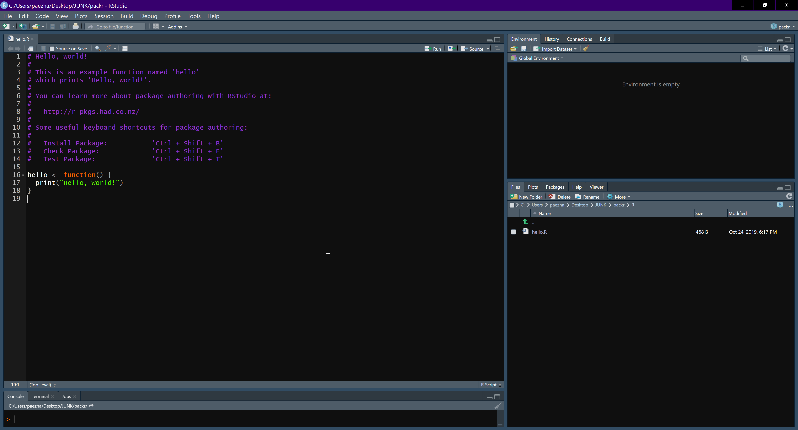
 
### `man/`

This is short for “manual”. In this directory will go the help files for the functions stored in R/. You can see that there is already a documentation file, for the function `hello.R`, in a file with the extension .Rd (for “R documentation”). Documentation is written in a syntax loosely based on LaTeX, and documentation files are rendered in different formats for ease of reading, including pdf, HTML, and plain text.
 
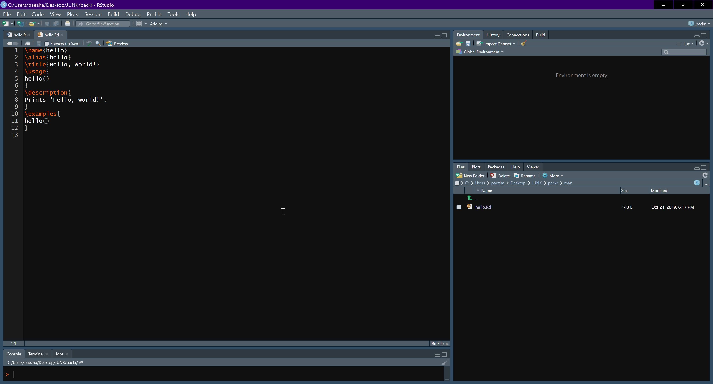

Writing documentation used to be one of the most tedious aspects of creating a package. Instead of writing these files by hand, a package called `roxygen2` can be used to create documentation. This package has several advantages over writing documentation manually:

- Code and documentation are linked, and if you change your code, you will be reminded to update your documentation files  
- The package creates a documentation template to work with, which saves time  
- It automates some aspects of documentation which makes the learning curve gentler  

Use of `roxygen2` means that you write your documentation directly in the script that contains your function, and this is translated into the syntax of `.Rd`.

Roxygen comments begin with `#'` to distinguish them from regular R comments. Notice the apostrophe! The sample function `hello()` that was intialized with my new package already had comments, but those were _regular R comments_. If I made changes to the description of the function and so on in the script, I would have to go and manually make changes in the corresponding `.Rd` file, and I do not want to do that.

Instead, I am going to convert the comments in the `hello()` function to make them roxygen comments:


To create `roxygen2` documentation, we use `devtools::document()`, which calls `roxygen2::roxygenize()` to do the hard work:
```
devtools::document()
```

Try this, and see what happens.


Oops! Some of the default documentation was not generated by `roxygen2` and will not be overwritten! So, what I will do instead is to delete the files that were not generated by roxygen2 and do all my documentation using this package (delete the files at this point).

Re-run `devtools::document()`:

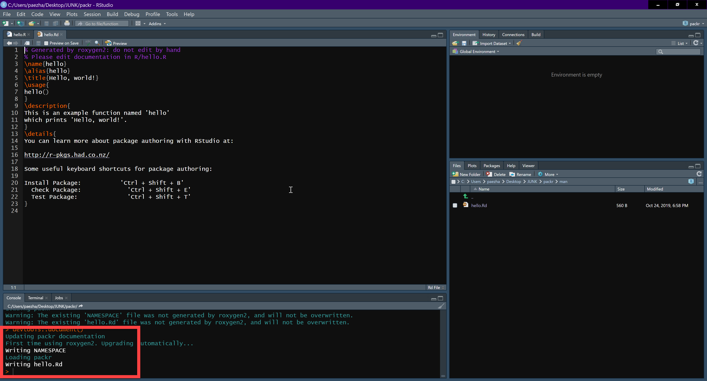

Now the documentation has been generated all using `roxygen2`, and there is a warning not to edit by hand! 

### Create an `R` script to document the package

We will add one more component to the package at this point, an `R` script to document the package. Create a new script, for instance by using the drop-down menu `File > New File > R Script`:

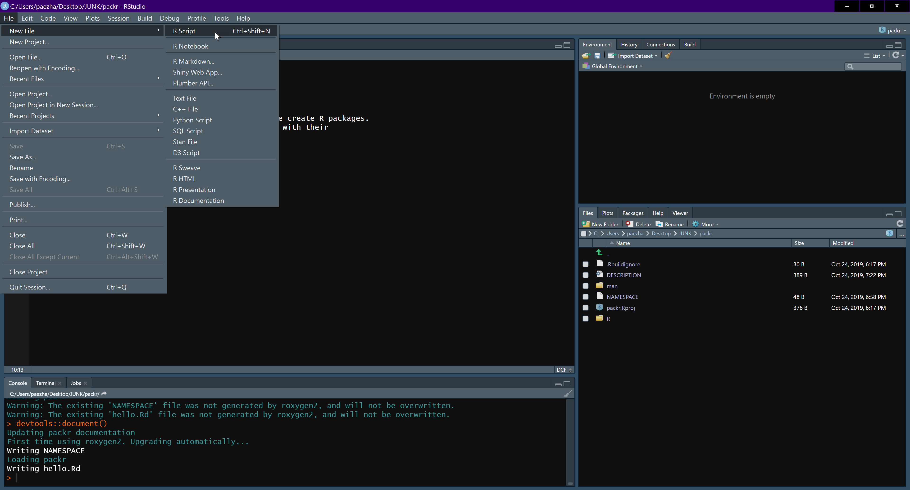

The name of the new script should be the same as the name of your package, In my case this is `packr.R`.

This script will consist only of comments, as follows (notice that the comments are in `roxygen2` style):
```
#' packr: A package with a minimum example of package creation.
#'
#' This package is an exercise in package creation using
#' R studio. The package includes a sample function and
#' a sample dataset with their respective documentation.
#'
#' @docType package
#' @name packr
#' @author Antonio Paez, School of Geography and Earth Sciences, McMaster University \email{paezha@@mcmaster.ca}
#' @references \url{https://github.com/paezha/Reproducible-Research-Workflow}
NULL
```

Create your own comments for your package now. The symbol `@` is used for tags. In the example, there are four types of tags in use: 

1. `@docType`: the type of document (package) 

2. `@name`: the name of the document (`packr`).

3. `@author`: the name of the author of the package, followed possibly by other information such as affiliation and email (notice the double `@@` in the email address; this is to distinguish it from a tag mark).

4. References (possibly with links).

At the end, _uncommented_ we write `NULL`.

There are many other tags that can be used to describe different aspects of a package, function, or dataset, and if you begin a comment in the script with `@` suggestions for tag will pop up for you:


To learn more about tags in documentation, check [this](https://roxygen2.r-lib.org/articles/rd.html).

Now proceed to regenerate the documentation. Any time that you add a function (or a dataset that needs documentation) this needs to be repeated:
```
devtools::document()
```

### Build the package

The components above constitute a minimal package. Now, we are ready to _build_ the package, that is, convert it from a collection of folders and files into a proper, distributable bundle. Again, we can do this from the command line, or we can do this in R Studio using the `Build` tab:

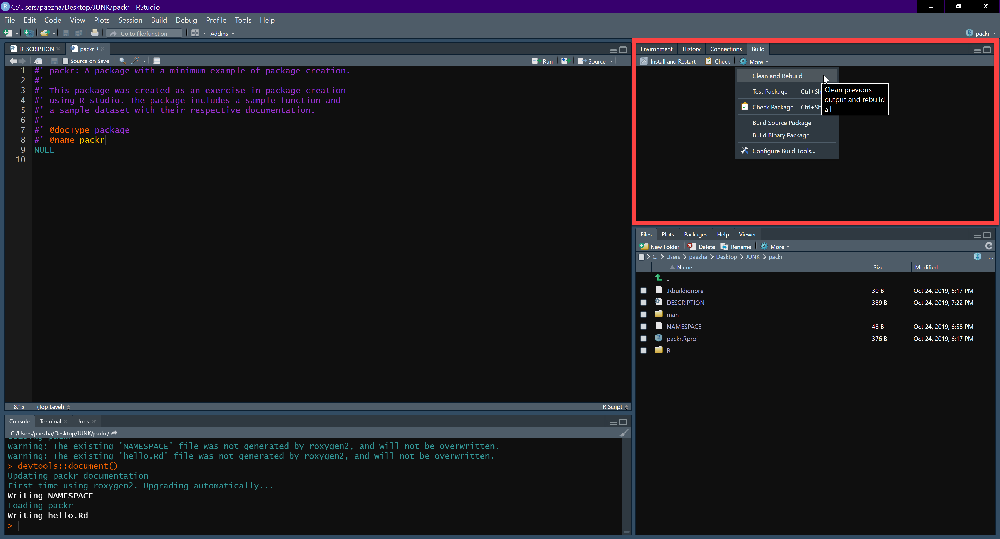

This tab includes a number of options to work with packages, including nstalling a package and restarting the R Studio session, testing the package, building the package, cleaning and rebuilding, etc. See below:

![Package building actions]

We can begin by _checking_ the build, to make sure that there are no errors This will run an extensive set of diagnostics to reduce the risk of a package not working or having other issues:

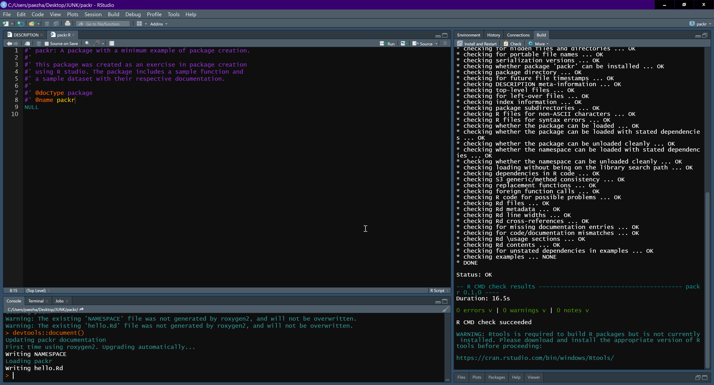

(Notice the warning to install Rtools).

Having found no warnings and no errors in the diagnostics, it is possible to _build_ the package. This is done by building a _source_ package, the alternative being building binaries (which are for users who lack the development tools, but since those are readily available I do not see much point to it):

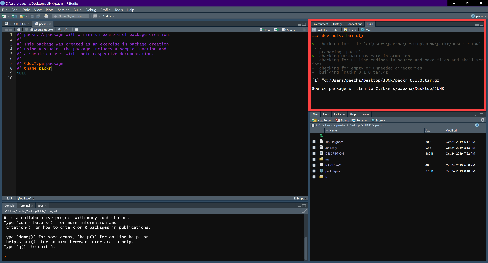

This will bundle everything that goes with the package. Click `Install and restart`:

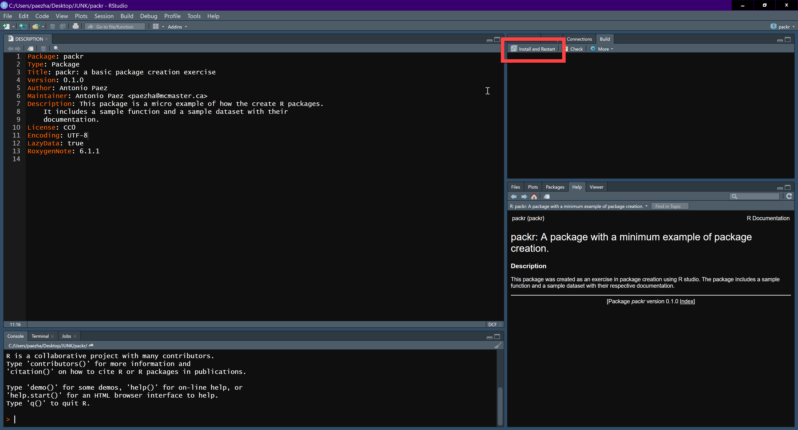

Next, try (use the name of your package):
```
?packr
```

This should display the description of the package. Also try: 
```
?hello
```
This should display the help file for the function.

### Creating a simple function

Now, we will create a new function to add to our package. To do this, create a new `R` script. In that script you can copy this example of a simple function, or feel free to create another function if you wish:

```
multiply <- function(a, b){
a * b
}
```

Notice that a function includes a name (`multiply`) and an assignment (`<-`) followed by `function()` with the arguments of the function (`a` and `b`). Then, between curly brackets (`{}`) all the operations that comprise the function (in this case simply `a * b`). Save this as R script as `multiply.R` in the R/ folder (or the name of your function). 

The basic function does something simple, and someone examining it can easily see what is going on. But more complex functions may not be as simple to read. Therefore, it is good practice to document the function. We can do this by adding roxygen comments to the script. Remember that roxygen comments begin with “#’” to distinguish them from regular comments. For this example function, the comments are:
```
#' Multiply two numbers
#'
#' @param a A number
#' @param b A number
#' @return The product of \code{a} and \code{b}
#' @examples
#' multiply(2, 5)
#' multiply(4, 8)
multiply <- function(a, b){
  a * b
}
```

We are using more tags here: to identify the parameters of the function, to describe the output (`@return`), and to include examples (`@examples`).

Run `devtools::document()` again. Navigate to your man/ folder, and you will see that there is a new documentation file for the function. Also, notice that this file cannot be edited manually – it is linked to the source script, which 1) saves you from having to work twice; and 2) ensures that you do not lose track of documentation files:
 
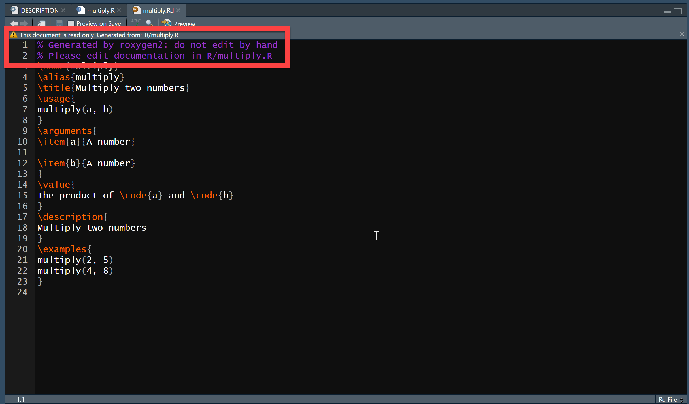

Clean and rebuild the package, and then try:
```
?multiply
```

And the examples in the documentation file:
```
multiply()

```

To learn more about functions check the resources [here](https://r4ds.had.co.nz/functions.html), and [here](https://nicercode.github.io/guides/functions/), and for some more advanced treatment [here](http://adv-r.had.co.nz/Functions.html).

### Private folders and files

Sometimes there will be things that are not part of the package, but that are part of the work process: this could be anything from notes, raw data, or experimental files. Packages have a way of handling situations like this by means of the `.Rbuildignore` file mentioned before. This file tells R which items to ignore when building the package. These items will not travel with the package. Useful to keep items that are not for sharing or are not necessary for the package.

Create a folder in the directory where your package files are. In the present example, I created a raw\ folder where to put my raw data. Wickham uses `raw-data/` for this purpose, and as you become more experienced you may find that other folders or files might be better ignored when building the package.

To declare a private folder, use `usethis::use_build_ignore` with the name of the folder or files that you want to add to the list of items that are ignored:
```
usethis::use_build_ignore("raw")
```

This will update the`.Rbuildignore` file accordingly:


Copy any data files (or other documents) that are not meant to be shared into this folder. For the example, this is simply an Excel file, but then a document to preprocess this file is created:

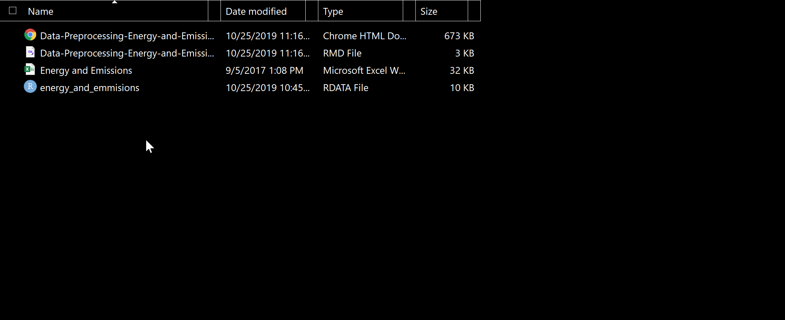

The outcome of preprocessing data is an `.RData` file. This process can be reiterated as desired for multiple data files: it is important to keep in mind that **each data file needs to go in its own `.RData` file!**

To include any data file or files as part of the package, a new folder called `data/` needs to be created, and the data file(s) copied there. It is now possible to document the data.

An important note is in order here.

Items declared in the `.Rbuildignore` file are ignored when building the package, but may be otherwise discoverable if you are using version control! In fact, you can check that my "private" folder is visible in the repository for the course.

If you wish to keep the folder with your data private, you will need to declare it in the `.gitignore` file too.

Once that the data file (or files) have been copied to the `data/` folder, it is possible to document the data.

### Data documentation

Unlike functions that are documented in their own script, data files do not have a script. This is similar to the package itself, that is documented in a specially created script for the comments. We will use the same script to document any and all data files that are included with the package.

The most convenient way of documenting a data file is using `roxygen2`. Using the same format, the structure of the documentation text is as follows:

1. A title for the dataset (e.g., `Energy and emissions data for world countries`)

2. A general description of the dataset, possibly in several lines or paragraphs even.

3. A tag for the `@format`: the format could be a dataframe, or it could be a raster image, or a matrix, or any of a large number of objects supported by `R`.

4. Possibly a list to `\describe` the data set, within curly brackets. Each item is also tagged as an `\item`, followed by the name of the item in curly brackets, and a description of the item also in curly brackets. For example:

```
\item{bblpd}{Estimated energy consumption in barrels of oil per day}
```

What information is important to understand the contents of the data set? Units, for instance. Date collected. Instruments used. Be exhaustive to reduce the risk that the data set becomes unusable due to poor documentation. I have seen many examples of data sets that do not indicate the units of measurement of stuff!

5. Other tags to characterize the data set. Some of them are

    - `@docType`: the type of document, in this case `data`
    
    - `@keywords`: datasets
    
    - `@name`: name of the dataset
    
    - `@usage`: how to use the dataset; typically this is `data(@name)`
    
    - `@reference`: the name of the paper where the data were published 
    
    - `@source`: the sources of information. For example, if using data from Statistics Canada, this is a good place to acknowledge it as a source  
    
    - `@examples`: examples of use
    
6. The name of the data set in quotation marks at the very end, _not commented_.

The documentation for the data set in the example looks like this in the end:
```
#' Energy and emissions data for world countries.
#'
#' A dataset containing information about 188 world countries, including
#' population estimates, GDP per capita, energy consumption estimates,
#' and CO_2 emissions.
#'
#' @format A data frame with 188 rows and 10 variables:
#' \describe{
#'   \item{Country name}{Names of countries as factor}
#'   \item{Area}{Surface land area of country in sq.km}
#'   \item{Population}{Population estimates}
#'   \item{PYear}{Year of the population estimate}
#'   \item{GDPPC}{Nominal GDP per capita in US dollars}
#'   \item{bblpd}{Estimated energy consumption in barrels of oil per day}
#'   \item{EYear}{Year of the energy consumption estimate}
#'   \item{CO2_1995}{CO_2 emissions in kilotonnes per year - 1995 estimates}
#'   \item{CO2_2005}{CO_2 emissions in kilotonnes per year - 2005 estimates}
#'   \item{CO2_2015}{CO_2 emissions in kilotonnes per year - 2015 estimates}
#' }
#'
#' @docType data
#' @keywords datasets
#' @name energy_and_emissions
#' @usage data(Dissonance_Santiago)
#' @source Energy Consumption Data Source: CIA Factbook, Refined Oil Products Consumption (https://www.cia.gov/library/publications/the-world-factbook/rankorder/2246rank.html) Accessed: September 5, 2017
#' @source CO2 Emissions Data Source: EC Emissions Database for Global Atmospheric Research (http://edgar.jrc.ec.europa.eu/overview.php?v=CO2ts1990-2015) Accessed: September 5, 2017
#' @source GDP Data Source: Wikipedia (https://en.wikipedia.org/wiki/List_of_countries_by_GDP_(nominal)_per_capita) Accessed: September 5, 2017
"energy_and_emissions"
#' @examples
#'  data(energy_and_emissions)
#'  GDPPC <- energy_and_emissions$GDPPC
"energy_and_emissions"
```

After the data sets have been documented, the documentation is recreated by means of `devtools::document()`, and the package is built/rebuilt.

Once this is done, try:
```
?energy_and_emissions
```

### A little help: vignettes

Help files are short documents that describe the key elements of a function or a data set. But it is possible to create more expansive examples to show potential users how to use your package, more like a user's manual than an entry in a dictionary. Vignettes are writen in markdown and are rendered in various formats for output.

A vignette is initialized using `usethis::use_vignette(name, title = name)`. For example:
```
usethis::use_vignette("packr-vignette")
```

The above will create a folder `vignettes/`, will initialize a vignette, and will create all necessary dependencies for the vignette (by updating the `DESCRIPTION` file).

You can then proceed to edit your vignette file. 

This is an example of a vignette:
```
browse_vignette("packr")
```

Notice that the vignette is not created by `roxigen2` but rather when the package is built, and therefore it will become available after installing the package from the `.tar.gz`.

### Activity

1. Create an `R` project for a new package. This can be under your GitHub repository or elsewhere.

2. Create at least one function, or more if you wish.

3. Prepare at least one sample data set for sharing with the package (more if you wish).

4. Document the package, the function(s), and the data set(s).

5. Build the package as a source; it will be a `.tar.gz` file.

6. If you created your package outside of your GitHub repository, post the package to the repository.

### Suggested readings

Parker, H. (2014) [Writing an R package from scratch](https://hilaryparker.com/2014/04/29/writing-an-r-package-from-scratch/)  

Broman, K. (n.d.) [R package primer: a minimal tutorial](https://kbroman.org/pkg_primer/)  
  
Wickham, H. (2015) [R packages: organize, test, document, and share your code](http://r-pkgs.had.co.nz/). O'Reilly Media.  
  
Khanal, A., and Khanal, S. (2018) [Building R packages](https://rstats-pkgs.readthedocs.io/en/latest/index.html#)

