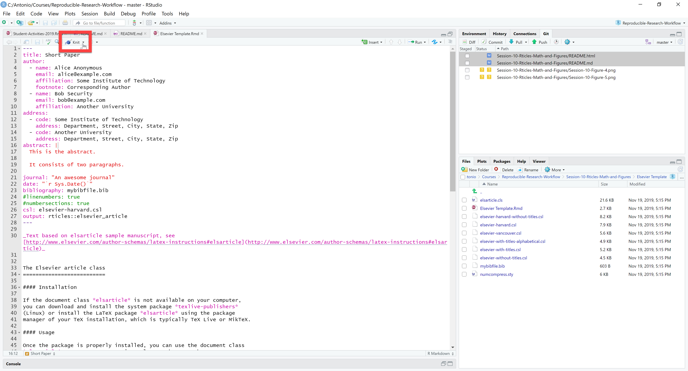

# GEOG 712 Reproducible Research

## Session 10. `rticles` and practical issues: math notation and figures

A package with a vignette is a neat example of a self-contained reproducible research unit. The package can be used to share data, documentation, code, and a document with data analysis.

Vignettes, however, are not the most common vehicle for research dissemination, and they are better seen as training documents. For most of us, a key format for research dissemination is the journal paper. In this and the following sessions we will introduce some useful tools for writing research in the form of a paper. To this end, we will build on our previous work with R Markdown. To recap, Markdown is a lightweight markup language that can be used to render documents into different kinds of outputs, such as html, pdf, and Word.

R Markdown expands on Markdown by allowing a document to include executable code. Previously we saw how chunks of code could be used in a Markdown document, and a number of different options to control the behavior of the code. Since R Markdown can be rendered into different formats, producing an article is a matter of presentation. A package to support the creation of a wide array of article formats was created by [Allaire et al.](https://github.com/rstudio/rticles). Here we will see how to create an article using `rticles`, with a focus on the use of mathematical notation and graphical output.

### The package `rticles` and article templates

To begin, you will need to install the package `rticles`. You can do this from the console as follows:

`install.packages("rticles")`

Or using the package management utilities in RStudio (see the `Packages` tab):


Once you have installed `rticles`, you can create a new R Markdown file from a template as follows, using the command line:

```
rmarkdown::draft("My-Paper.Rmd", template = "jss_article", package = "rticles")
```

Or, conveniently, you can create a new R Markdown file from the `File` drop-down menu:


And then selecting the option to create an R Markdown file from a template:


As you can see, there is a large selection of templates to choose from, based on different publisher's specifications. Begin by selecting the template for an Elsevier Journal Article. You need to select a location for the new R Markdown file. Once you do so, and create the new file, a folder for it will be created in the designated location. It will look like this:


The R Markdown file is accompanied by a set of support files that include the document configurations preferred by the publisher (with the extension .cls). Another file that accompanies the R Markdown document is `nuncompress.sty`; this includes styling descriptions for the output. Finally, there is a file called `mybibfile.bib`; this is a [BibTex](https://en.wikipedia.org/wiki/BibTeX) file used to store and manage references (more on this in the following session). 

## The R Markdown Template

If you open the R Markdown document in R Studio, this is what you will see:


Recall that the first part of the document is the YAML header:

---
title: Short Paper
author:
  - name: Alice Anonymous
    email: alice@example.com
    affiliation: Some Institute of Technology
    footnote: Corresponding Author
  - name: Bob Security
    email: bob@example.com
    affiliation: Another University
address:
  - code: Some Institute of Technology
    address: Department, Street, City, State, Zip
  - code: Another University
    address: Department, Street, City, State, Zip
abstract: |
  This is the abstract.

  It consists of two paragraphs.

journal: "An awesome journal"
date: "`r Sys.Date()`"
bibliography: mybibfile.bib
#linenumbers: true
#numbersections: true
csl: elsevier-harvard.csl
output: rticles::elsevier_article
---

The header in this case has been initialized with some important information: about the authors, their addresses, and the abstract. In addition, the header includes the abstract, a field for the journal name (which is used to create footers), as well as the date. It also specifies the BibTex used for the bibliography, the .csl file to use, and the output. Notice that not all .csl files are used: in the default template, only `elsevier-harvard.csl` is called.

Two fields are commented:

```
#linenumbers: true
#numbersections: true
```

If you want the output document to have line numbers and/or numbered sections, uncomment these as appropriate.

Anything below the YAML header is written in Markdown (with R code as appropriate) and/or LaTeX. Markdown is easier, LaTeX more precise.

Notice that in this document, section headings are distinguished in this way:

```
The Elsevier article class
==========================
```

This, for example, would be the title of the first section in the output document. Lower level headings use Markdown formatting styles, so that `##` is a second-level header, `###` a third-level heading, and so on.

The documented is rendered by _knitting_ it (recall that this relies on the package `knitr`):




