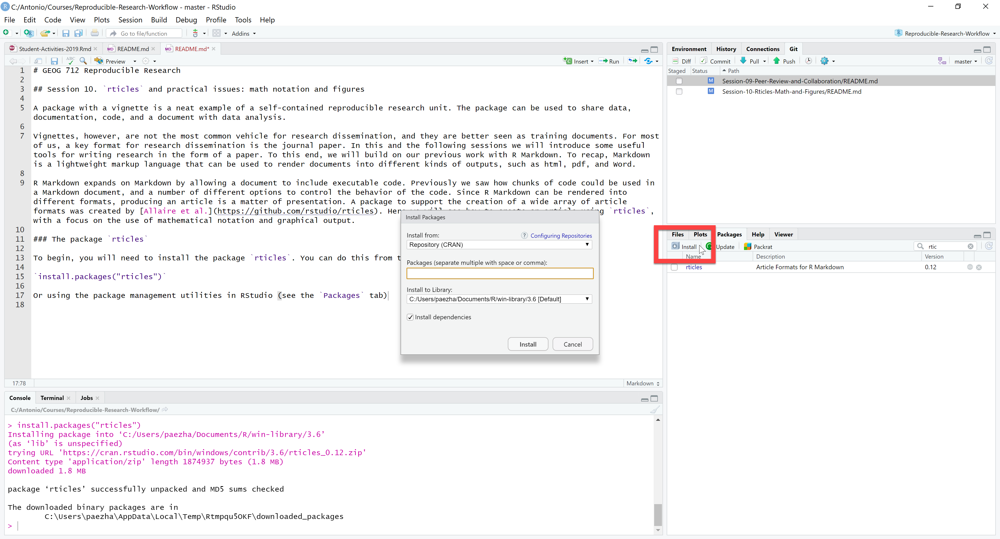

# GEOG 712 Reproducible Research

## Session 10. `rticles` and practical issues: math notation and figures

A package with a vignette is a neat example of a self-contained reproducible research unit. The package can be used to share data, documentation, code, and a document with data analysis.

Vignettes, however, are not the most common vehicle for research dissemination, and they are better seen as training documents. For most of us, a key format for research dissemination is the journal paper. In this and the following sessions we will introduce some useful tools for writing research in the form of a paper. To this end, we will build on our previous work with R Markdown. To recap, Markdown is a lightweight markup language that can be used to render documents into different kinds of outputs, such as html, pdf, and Word.

R Markdown expands on Markdown by allowing a document to include executable code. Previously we saw how chunks of code could be used in a Markdown document, and a number of different options to control the behavior of the code. Since R Markdown can be rendered into different formats, producing an article is a matter of presentation. A package to support the creation of a wide array of article formats was created by [Allaire et al.](https://github.com/rstudio/rticles). Here we will see how to create an article using `rticles`, with a focus on the use of mathematical notation and graphical output.

### The package `rticles`

To begin, you will need to install the package `rticles`. You can do this from the console as follows:

`install.packages("rticles")`

Or using the package management utilities in RStudio (see the `Packages` tab):



Once you have installed `rticles`, you can create a new R Markdown file from a template as follows, using the command line:

```
rmarkdown::draft("MyJSSArticle.Rmd", template = "jss_article", package = "rticles")
```

Or, conveniently, you can create a new R Markdown file from the `File` drop-down menu:


And then selecting the option to create an R Markdown file from a template:

