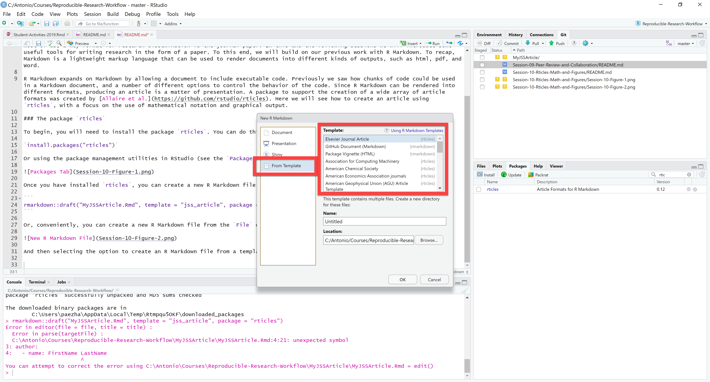
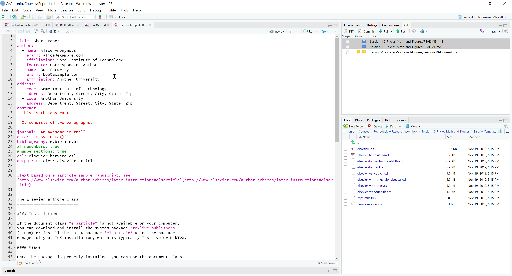
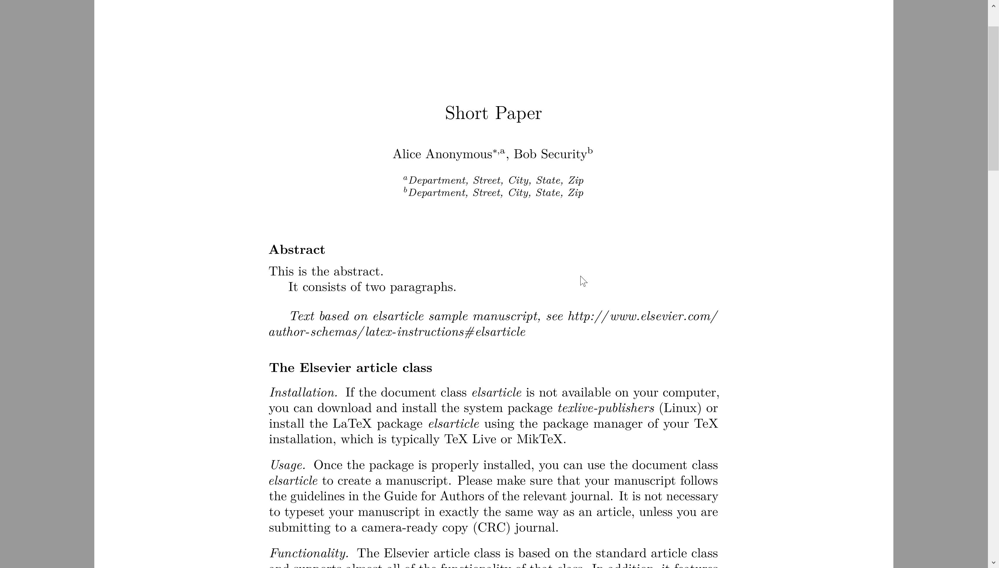

# GEOG 712 Reproducible Research

## Session 10. `rticles` and practical issues: math notation and figures

A package with a vignette is a neat example of a self-contained reproducible research unit. The package can be used to share data, documentation, code, and a document with data analysis.

Vignettes, however, are not the most common vehicle for research dissemination, and they are better seen as training documents. For most of us, a key format for research dissemination is the journal paper. In this and the following sessions we will introduce some useful tools for writing research in the form of a paper. To this end, we will build on our previous work with R Markdown. To recap, Markdown is a lightweight markup language that can be used to render documents into different kinds of outputs, such as html, pdf, and Word.

R Markdown expands on Markdown by allowing a document to include executable code. Previously we saw how chunks of code could be used in a Markdown document, and a number of different options to control the behavior of the code. Since R Markdown can be rendered into different formats, producing an article is a matter of presentation. A package to support the creation of a wide array of article formats was created by [Allaire et al.](https://github.com/rstudio/rticles). Here we will see how to create an article using `rticles`, with a focus on the use of mathematical notation and graphical output.

### The package `rticles` and article templates

To begin, you will need to install the package `rticles`. You can do this from the console as follows:

`install.packages("rticles")`

Or using the package management utilities in RStudio (see the `Packages` tab):


Once you have installed `rticles`, you can create a new R Markdown file from a template as follows, using the command line:

```
rmarkdown::draft("My-Paper.Rmd", template = "jss_article", package = "rticles")
```

Or, conveniently, you can create a new R Markdown file from the `File` drop-down menu:


And then selecting the option to create an R Markdown file from a template:



As you can see, there is a large selection of templates to choose from, based on different publisher's specifications. Begin by selecting the template for an Elsevier Journal Article. You need to select a location for the new R Markdown file. Once you do so, and create the new file, a folder for it will be created in the designated location. It will look like this:


The R Markdown file is accompanied by a set of support files that include the document configurations preferred by the publisher (with the extension .cls). Another file that accompanies the R Markdown document is `nuncompress.sty`; this includes styling descriptions for the output. Finally, there is a file called `mybibfile.bib`; this is a [BibTex](https://en.wikipedia.org/wiki/BibTeX) file used to store and manage references (more on this in the following session). 

## The R Markdown Template

If you open the R Markdown document in R Studio, this is what you will see:



Recall that the first part of the document is the YAML header:

```
---
title: Short Paper
author:
  - name: Alice Anonymous
    email: alice@example.com
    affiliation: Some Institute of Technology
    footnote: Corresponding Author
  - name: Bob Security
    email: bob@example.com
    affiliation: Another University
address:
  - code: Some Institute of Technology
    address: Department, Street, City, State, Zip
  - code: Another University
    address: Department, Street, City, State, Zip
abstract: |
  This is the abstract.

  It consists of two paragraphs.

journal: "An awesome journal"
date: "`r Sys.Date()`"
bibliography: mybibfile.bib
#linenumbers: true
#numbersections: true
csl: elsevier-harvard.csl
output: rticles::elsevier_article
---
```

The header in this case has been initialized with some important information: about the authors, their addresses, and the abstract. In addition, the header includes the abstract, a field for the journal name (which is used to create footers), as well as the date. It also specifies the BibTex used for the bibliography, the .csl file to use, and the output. Notice that not all .csl files are used: in the default template, only `elsevier-harvard.csl` is called.

Two fields are commented:

```
#linenumbers: true
#numbersections: true
```

If you want the output document to have line numbers and/or numbered sections, uncomment these as appropriate.

Anything below the YAML header is written in Markdown (with R code as appropriate) and/or LaTeX. Markdown is easier, LaTeX more precise.

Notice that in this document, section headings are distinguished in this way:

```
The Elsevier article class
==========================
```

This, for example, would be the title of the first section in the output document. Lower level headings use Markdown formatting styles, so that `##` is a second-level header, `###` a third-level heading, and so on.

The documented is rendered by _knitting_ it (recall that this relies on the package `knitr`):


The output is a pdf file, as follows:



Now that you have a document to work, lets take a look at some ways to present research, beginning with mathematical expressions.

## Mathematical notation in LaTeX

Markdown is simple to use, but lacks the functionality to format mathematical notation. In fairness, the same was true of other word processing applications. For instance, Word did not have the functionality for a long time, and now that it does it is super-clunky. The downside of writing in LaTeX is that you need to learn LaTeX. Fortunately, Markdown provides a relatively gentle introduction to LaTeX, including mathematical notation. It is like learning the way Martians (or Mathematicians) write.

> First rule: inline LaTeX in Markdown goes between string signs, like so \$x\$

Just like that, we wrote something in mathematical notation: $x$.

> Second rule: to write mathematical notation in _display_ mode, you need two string signs \$\$ enclosing the LaTeX stuff

For example:

```
$$
x + y
$$
```

The above renders as:

$$
x + y
$$

It is also possible to use LaTeX directly. For example, the following:

```
\[x + y\]
```

_also_ renders as:

\[x + y\]

Some common elements of mathematical notation are signs. Whenever the signs are available in the keyboard, they can be used. For example, the following three expressions:

```
x + y = z\\
x - y > z\\
x  y < z
```

render as:
$$
x + y = z\\
x - y > z\\
x  y < z
$$

Notice that I used "`\\`" to introduce line breaks between my three expressions. Had I not used these signs, my expressions would have been mashed together. The following:
```
x + y = z
x - y > z
x  y < z
```

renders as:
$$
x + y = z  
x - y > z  
x  y < z
$$

Other common elements of mathematical notation are subscripts and superscripts. Subscripts are obtained by using the underscore sign `_`:
```
x_i + y_i = z_i\\
x_i - y_i > z_i\\
x_i  y_i < z_i
```

which renders as:
$$
x_i + y_i = z_i\\
x_i - y_i > z_i\\
x_i  y_i < z_i
$$

Superscripts are obtained by using the _caret_ sign `^`:
```
x^2 + y^2 = z^2\\
x^2 - y^2 > z^2\\
x^2  y^2 < z^2
```

which renders as:
$$
x^2 + y^2 = z^2\\
x^2 - y^2 > z^2\\
x^2  y^2 < z^2
$$

If you need more than one subscript or superscript you can group them using curly brackets "`{}`":
```
x_{ij} + y_{ij} = z_{ij}\\
x_{ij} - y_{ij} > z_{ij}\\
x_{ij}  y_{ij} < z_{ij}
```

to give:
$$
x_{ij} + y_{ij} = z_{ij}\\
x_{ij} - y_{ij} > z_{ij}\\
x_{ij}  y_{ij} < z_{ij}
$$

Fractions are written using the LaTeX expression `\frac{}{}`, where the first set of curly brackets encompasses the numerator and the second the denominator:
```
\frac{x - y}{x + y}
```

This fraction is displayed as:
$$
\frac{x - y}{x + y}
$$

The notation can be nested. See for example:
```
\frac{x^2 + y^2}{\frac{x^2}{2} + y^2}
```

which renders as:
$$
\frac{x^2 - y^2}{\frac{x^2}{2} + y^2}
$$

Notice the use of the backslash "`\`" before the LaTeX command `frac`. Commonly, the backslash indicates a LaTeX command. Another common command is "`\sum`", to write summations:
```
\sum x_i
```

to give:
$$
\sum x_i
$$

To which we can add the limits of the summation as follows (using the same notation for subscripts and superscripts):
```
\sum_{i=1}^n x_i
```

Now, the summation displays as:
$$
\sum_{i=1}^n x_i
$$

Then, of course, we could not write math without Greek letters! These letters are also LaTeX commands:
```
\alpha\\
\beta\\
\delta
```

This produces the following letters:
$$
\alpha\\
\beta\\
\delta
$$

One thing that R Markdown does not do (at least not yet), is automatically numbering equations. However, since we can use LaTeX, we could write mathematical notation in an _environment_:
```
\begin{equation}
\sum_{i=1}^n x_i
\end{equation}
```

We can also add _labels_ to the equations, so that we can reference them in the text, for example:
```
\begin{equation}
\label{my-equation}
\sum_{i=1}^n x_i
\end{equation}
```

References to that equation would take this form: "`\ref{my-equation}`"

As an example, copy the following text in your article file and knit:

---

```
Methods
============

## Spatial Autocorrelation and Map Pattern

Spatial autocorrelation is a condition whereby the value of a variable at one location is correlated with the value(s) of the same variable at one or more proximal locations. A tool widely used to measure spatial autocorrelation is Moran’s coefficient of autocorrelation, or $MC$ for short. In matrix form, $MC$ can be formulated as follows:

\begin{equation} 
\label{eq:1}
MC=\frac{n}{\sum_{i}{\sum_{j}{w_{ij}}}}\frac{x'Wx}{x'x}
\end{equation}

where $x$ is a vector $(n\times1)$ of mean-centered values of a georeferenced variable, and $W$ is a spatial weights matrix of dimensions $(n\times n)$ with elements $w_{ij}$. The elements of the spatial weights matrix take non-zero values if locations $i$ and $j$ are deemed to be spatially proximate in some sense, and 0 otherwise. It can be appreciated that the coefficient is composed to two elements: the variance of the random variable (i.e., $(x' x)⁄n$) and its spatial autocovariance $\frac{(x'Wx)}{\sum_{i}{\sum_{j}{w_{ij}}}}$. As an alternative, the numerator of the right-hand term of Equation \ref{eq:1} can be expressed as follows:

\begin{equation} 
\label{eq:2}
x'\Big(I - \frac{11'}{n}\Big)W\Big(I - \frac{11'}{n}\Big)x
\end{equation}

with $I$ as the identity matrix of size $n\times n$ and $1$ a conformable vector of ones.

One possible interpretation of spatial autocorrelation is as map pattern. More concretely, the eigenvalues of the following matrix represent the range of possible values of $MC$ given a spatial weights matrix $W$, and the extreme eigenvalues are in fact associated with the minimum and maximum values of $MC$ for the system of relationships represented by $W$:

\begin{equation} 
\label{eq:3}
\Big(I - \frac{11'}{n}\Big)W\Big(I - \frac{11'}{n}\Big)
\end{equation}

A remarkable discovery is that the eigenvectors associated with the eigenvalues of the matrix in Expression \ref{eq:3} represent a catalogue of latent map patterns, each with a level of autocorrelation (as measured by $MC$) given by its corresponding eigenvalue. Furthermore, the patterns represented by the eigenvectors are orthogonal by design, and so they furnish $n$ maps that are independent from each other. Since these map patterns depend only on the spatial weights matrix – and not the spatial random variable – they constitute an extensive set of latent map patterns that can be used in regression analysis as filters. This is explained next.
```

---

Another expressions that I have found useful is the _array_ to organize matrices, long equations, systems of equations. For example:
```
\left(
\begin{array}\\
x & y & z \\
x - 1 & y + 1 & 2z
\end{array}
\right)
```

This is displayed as follows:
$$
\left(
\begin{array}\\
x & y & z \\
x - 1 & y + 1 & 2z
\end{array}
\right)
$$

Notice that "`\left`" and "`\right`" are used to create the large parentheses that enclose the matrix, and the ampersand sign "`&`" is used to separate element of the array.

Finally, piecewise functions can be written using the "`\case`" command:
```
y = \begin{cases}\\
1 & \text{if } r \leq 1\\
0 & \text{otherwise}
\end{cases}
```

The above displays as follows:
$$
y = \begin{cases}
1 & \text{if } r \leq 1\\
0 & \text{otherwise}
\end{cases}
$$

More examples of mathematical notation can be seen below.

## Figures

You have already seen that figures can be introduced into Markdown files as follows:
```

```

with the caption or title of the figure between the square brackets, and the path to the file between the brackets. If you save all your figures as files, you could easily use this approach to populate your paper with your graphical output. This assumes that the figures were produced elsewhere and then that they were saved. While possible, this is not a very attractive alternative, because it separates a key element of the process of your analysis (visualization) from the rest of your paper. 

One of the most appealing aspects of working with R Markdown is that the figures can be produced internally as part of the document. We saw examples of this before, with vignettes, for instance.

Suppose that I want to do report some analysis using data set in the package `packr`.


## More examples of mathematical notation

Here are a few more examples of mathematical notation (followed by their displayed version).

```
\hat{\beta}=(X'X)^{-1}X'Y
```
$$
\hat{\beta}=(X'X)^{-1}X'Y
$$

```
Y=f\big([X^+, E_q],[\beta,\delta_q]\big)+\epsilon
```
$$
Y=f\big([X^+, E_q],[\beta,\delta_q]\big)+\epsilon
$$

```
\begin{array}
V_{i,\text{N}} - V_{i,\text{P}} & = \beta_1\text{cost}_{i,\text{N}} + \beta_2\text{ speed}_{i,\text{N}} + \beta_3\text{income}_i - \mu - \beta_1\text{cost}_{i,\text{P}} - \beta_1\text{speed}_{\text{i, P}} - \beta_1\text{income}_i\\ 
& = \beta_1(\text{cost}_{i, \text{N}} - \text{cost}_{i, \text{P}}) + \beta_2(\text{ speed}_{i, \text{N}} - \text{ speed}_{i, \text{P}}) + \beta_3(\text{ income}_i - \text{ income}_i) - \mu
\end{array}
```

$$
\begin{array}\\
V_{i,\text{N}} - V_{i,\text{P}} & = \beta_1\text{cost}_{i,\text{N}} + \beta_2\text{ speed}_{i,\text{N}} + \beta_3\text{income}_i - \mu - \beta_1\text{cost}_{i,\text{P}} - \beta_1\text{speed}_{\text{i, P}} - \beta_1\text{income}_i\\ 
& = \beta_1(\text{cost}_{i, \text{N}} - \text{cost}_{i, \text{P}}) + \beta_2(\text{ speed}_{i, \text{N}} - \text{ speed}_{i, \text{P}}) + \beta_3(\text{ income}_i - \text{ income}_i) - \mu
\end{array}
$$

## Suggested readings

[LaTeX for Beginners](http://www.docs.is.ed.ac.uk/skills/documents/3722/3722-2014.pdf)


